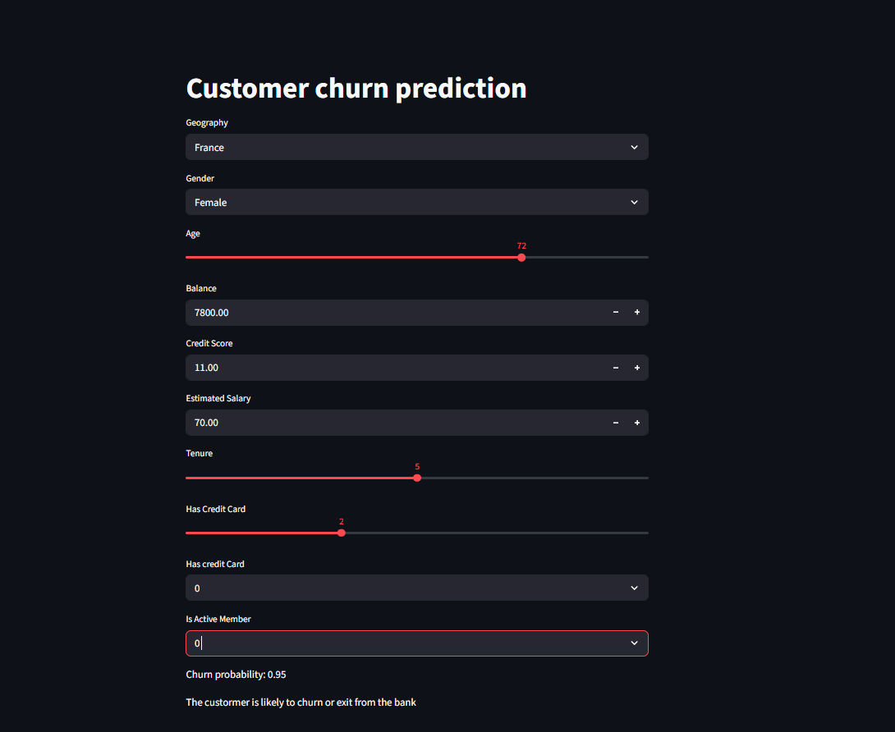

# Customer Churn Prediction – Mini Learning Project



## About this Project

This is a **mini learning project** I created just for fun to explore **Python, Machine Learning, and Streamlit**.  
The goal was to build a simple web app that predicts whether a bank customer might churn based on some basic inputs like age, credit score, geography, and account information.

> ⚡ **Disclaimer:** This is purely a learning exercise — it’s not production-ready, and the dataset or model used is for practice only.

---

## What I Learned

- Loading and using a **pre-trained TensorFlow model** in Python.
- Encoding categorical features with **LabelEncoder** and **OneHotEncoder**.
- Scaling numeric features with **StandardScaler**.
- Building a simple **interactive web app using Streamlit**.
- Combining multiple Python libraries in a small, fun project.

---

## How to Run

1. Clone this repository (or download the files).
2. Make sure you have Python installed.
3. Install the dependencies:
   ```bash
   pip install streamlit pandas numpy scikit-learn tensorflow
   ```
4. Run the Streamlit app:
   ```bash
   streamlit run app.py
   ```
5. Play around with the sliders, inputs, and select boxes to see how the prediction changes.

---

## Notes

- This project was done for **learning and experimentation**, not for professional use.
- The interface is simple and minimalistic — the main focus was to get hands-on experience with ML and web apps.

---

## Live Demo

Check out the app live here: [Customer Churn Prediction App](https://ann-basics-7nmgz5g2cwlmgsc2yprthx.streamlit.app/)

---


